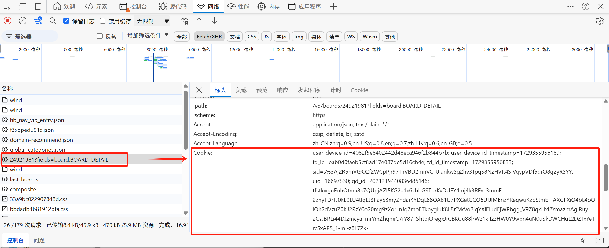
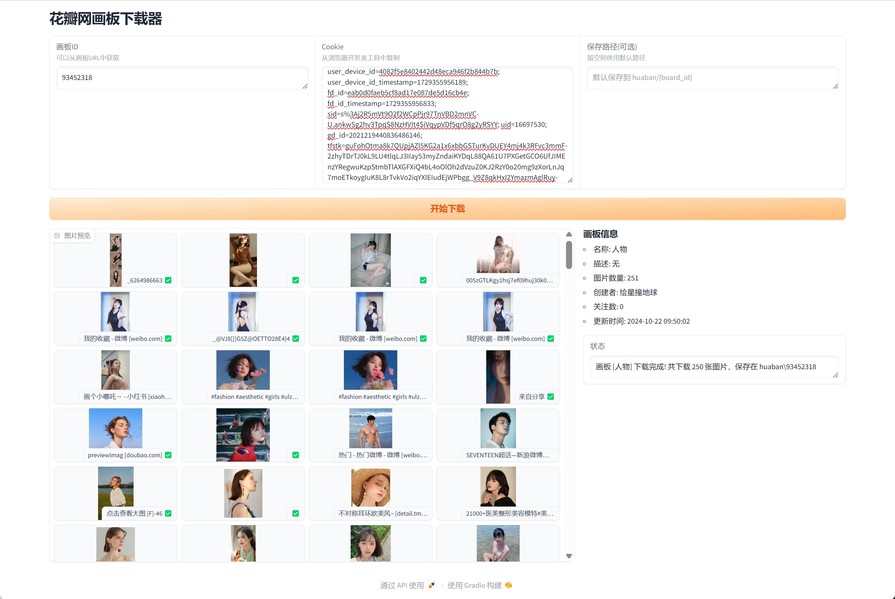

# 花瓣网画板下载器

一个简单易用的花瓣网画板图片批量下载工具，提供图形界面操作。

> 炼丹收集素材太费事了，好吧，这个就是为了给炼丹收集素材提效的

## 功能特点

- 支持通过画板ID下载整个画板的图片
- 提供友好的图形界面
- 显示画板详细信息
- 实时显示下载进度
- 支持图片预览和单张下载
- 自动保存原始图片质量
- 使用图片描述作为文件名

## 安装说明

1. 确保已安装 Python 3.11版本
2. 克隆或下载本项目
3. 安装依赖包：
```bash
pip install -r requirements.txt
```

## 使用方法

1. 运行程序：
```bash
python app.py
```

2. 在浏览器中打开显示的地址（通常是 http://127.0.0.1:7860）

3. 准备必要信息：
   - **画板ID**：从花瓣网画板URL中获取
     - 例如：https://huaban.com/boards/94146939 中的 `94146939`
   - **Cookie**：从浏览器中获取
     - 打开花瓣网并登录
     - 按 F12 打开开发者工具
     - 在 Network 标签页中找到任意请求
     - 在请求头中复制 Cookie 字段的值
   - 参考下图位置获取Cookie:
   

4. 填写信息：
   - 将画板ID粘贴到对应输入框
   - 将Cookie粘贴到Cookie输入框
   - 可选：指定保存路径（默认保存到 huaban/{board_id} 目录）
   

5. 点击"开始下载"按钮开始下载

## 界面说明

- **画板信息**：显示画板标题、描述、图片数量等信息
- **图片预览**：
  - 显示所有图片的预览
  - 每张图片下方显示描述和来源
  - ✅ 表示下载成功
  - ❌ 表示下载失败
- **下载进度**：实时显示当前下载进度
- **状态信息**：显示下载完成状态和保存路径

## 文件说明

- `app.py`: 主程序，包含图形界面实现
- `downloader.py`: 下载核心逻辑
- `huaban/`: 默认的图片保存目录

## 注意事项

1. 需要登录花瓣网并获取有效的Cookie
2. 下载速度受网络条件和图片数量影响
3. 保存路径如果不存在会自动创建
4. 重复运行时会跳过已下载的图片

## 常见问题

1. **无法启动程序**
   - 检查是否已安装所有依赖
   - 确保Python版本正确

2. **下载失败**
   - 检查Cookie是否有效
   - 确认网络连接正常

3. **界面无响应**
   - 刷新页面
   - 重启程序

## 更新日志

### v1.0.0 (2024-03-06)
- 初始版本发布
- 支持基本的画板下载功能
- 提供图形界面操作

## 许可证

MIT License

## 贡献

欢迎提交 Issue 和 Pull Request！

## 致谢

感谢花瓣网提供的图片资源，使用请按照版权的要求。